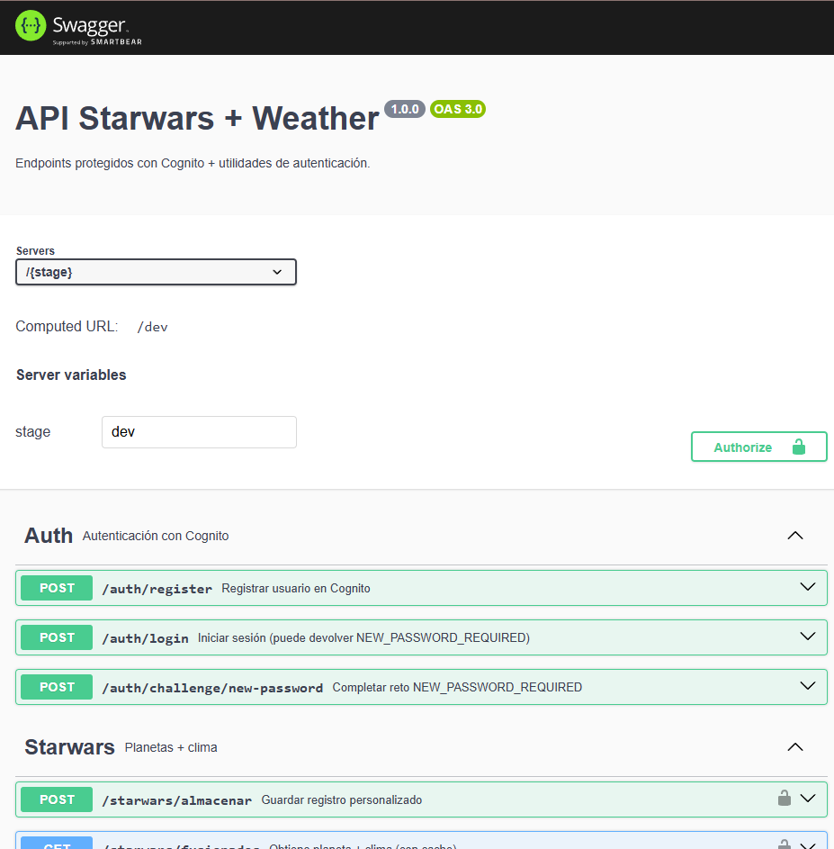

# 🌌 API StarWars Weather

Proyecto **Serverless (AWS Lambda + API Gateway)** en **TypeScript** para consultar información de **planetas de Star Wars** enriquecida con **clima**, junto a endpoints de **autenticación con Amazon Cognito**.
La solución demuestra buenas prácticas de arquitectura (IoC, casos de uso), pruebas unitarias y BDD.

---

## 🔎 Quickstart

```bash
# 1) Instalar deps
npm install

# 2) Correr unit tests (Jest)
npm test

# 3) Correr escenarios BDD (Cucumber)
npm run bdd

# 4) Levantar Swagger UI (OpenAPI docs)
npm run documentation

# 5) Levantar API en local (si tienes serverless-offline configurado)
npm run offline
```

> Swagger: http://localhost:8080/docs

---

## 🚀 Funcionalidad

- **Auth**
  - `POST /auth/register` → Registro de usuario en Cognito.
  - `POST /auth/login` → Inicio de sesión (tokens) o reto `NEW_PASSWORD_REQUIRED`.
  - `POST /auth/challenge/new-password` → Completa el reto `NEW_PASSWORD_REQUIRED`.
- **Starwars**
  - `GET /starwars/fusionados?planetId={1..60}` → Fusiona datos de planeta (SWAPI) + clima (cache 30 min).
  - `POST /starwars/almacenados` → Guarda un registro personalizado (historial).
  - `GET /starwars/historial?limit=&nextPk=&nextSk=` → Lista historial paginado.

---

## 🛠️ Tecnologías y patrones

- **TypeScript** + **Serverless Framework** (Node 20)
- **IoC con inversify** (`Container`, `Types`) → fácil de testear con mocks
- **Arquitectura por casos de uso** (cada feature con `usecase.ts` + `handler.ts`)
- **Capa Core** (`core`) para controller, validaciones y respuestas uniformes
- **Testing**
  - **Jest** → unitarios de `auth` y `starwars`
  - **Cucumber.js + Gherkin** → escenarios BDD (fusionados, almacenados, historial) con mocks IoC

---

## 📂 Estructura del proyecto (resumen)

```
├── lambdas/auth/src/app/                # auth use cases (register, login, challenges)
│   ├── create-user/
│   ├── login/
│   ├── challenge-newpassword/
│   └── challenge-mfa/                   # (código base; puede no estar en OpenAPI)
├── lambdas/starwars/src/app/            # starwars use cases (fusionados, almacenados, historial)
├── lambdas/*/src/config/                # Container IoC y Types
├── lambdas/*/src/dao/                   # DAOs (swapi, weather, storage, auth)
├── _layers/core/nodejs/@core/           # capa core compartida (controller, utils, http)
├── docs/openapi.yml                     # especificación OpenAPI
└── tests/
    ├── factories/                       # makeApiEvent y utils
    ├── features/                        # Gherkin .feature
    │   └── starwars/                    # fusionados/almacenados/historial.feature
    └── features/steps/                  # step definitions (incluye _common.steps.ts)
```

---

## 📜 Endpoints (detalle rápido)

### Auth

#### 1) `POST /auth/register`

**Body**

```json
{ "email": "user@example.com", "password": "Passw0rd!" }
```

**Response 200**

```json
{
  "status": "created",
  "details": {
    /* payload de creación en Cognito */
  }
}
```

#### 2) `POST /auth/login`

**Body**

```json
{ "email": "user@example.com", "password": "Passw0rd!" }
```

**Response 200 (tokens)**

```json
{
  "status": "ok",
  "details": {
    "ok": true,
    "data": {
      "accessToken": "...",
      "idToken": "...",
      "refreshToken": "...",
      "expiresIn": 1800,
      "tokenType": "Bearer"
    }
  }
}
```

**Response 200 (reto NEW_PASSWORD_REQUIRED)**

```json
{
  "status": "ok",
  "details": {
    "ok": false,
    "data": {
      "challenge": "NEW_PASSWORD_REQUIRED",
      "session": "...",
      "parameters": {
        /* datos adicionales */
      }
    }
  }
}
```

#### 3) `POST /auth/challenge/new-password`

Completa el reto **NEW_PASSWORD_REQUIRED**.
**Body**

```json
{
  "username": "user@example.com",
  "newPassword": "NuevoPassw0rd!",
  "session": "..."
}
```

**Response 200**

```json
{
  "status": "ok",
  "details": {
    "ok": true,
    "data": {
      "accessToken": "...",
      "idToken": "...",
      "refreshToken": "...",
      "expiresIn": 1800,
      "tokenType": "Bearer"
    }
  }
}
```

> **Variables de entorno necesarias** para `auth`: `APP_REGION`, `USER_POOL_ID`, `USER_POOL_CLIENT_ID`.
> En BDD/Unit tests se mockean vía IoC, por lo que no son requeridas.

---

### Starwars

#### 1) `GET /starwars/fusionados?planetId={1..60}`

**Ejemplo**

```bash
curl "http://localhost:3000/dev/starwars/fusionados?planetId=1"
```

**Response 200**

```json
{
  "status": "ok",
  "cached": false,
  "details": {
    "id": 1,
    "name": "Tatooine",
    "climate": "arid",
    "terrain": "desert",
    "population": "200000",
    "weather": { "temperature": 30, "windspeed": 3, "time": "..." },
    "source": { "planetUrl": "https://swapi.info/api/planets/1" }
  }
}
```

#### 2) `POST /starwars/almacenados`

**Body**

```json
{ "planetId": 5, "notes": "nota x" }
```

**Response 200**

```json
{ "status": "created", "details": { "id": "uuid..." } }
```

#### 3) `GET /starwars/historial?limit=&nextPk=&nextSk=`

**Response 200**

```json
{
  "status": "ok",
  "details": {
    "items": [
      { "ts": 1730000000000, "payload": { "planetId": 1, "name": "Tatooine" } }
    ],
    "nextPk": "fusion#1",
    "nextSk": 1730000001000
  }
}
```

---

## 📖 Documentación (Swagger/OpenAPI)

El archivo `docs/openapi.yml` contiene la especificación OpenAPI.

### Ver documentación localmente (Swagger UI)

```bash
npm run documentation
```

Se abrirá automáticamente: **http://localhost:8080/docs**



---

## 🧪 Testing

### Unit (Jest)

```bash
npm test
```

### BDD (Cucumber)

```bash
npm run bdd
```

> Escenarios en `tests/features/**` (fusionados, almacenados, historial) con steps en `tests/features/steps/**`.

---

## 🧭 Arquitectura (diagrama)

```
        ┌─────────────────────────────────────────────────────┐
        │                  API Gateway (HTTP)                 │
        └───────────────▲─────────────────────────────────────┘
                        │  evento APIGW (makeApiEvent en tests)
                        │
                ┌───────┴────────┐
                │   Handlers     │  lambdas/*/src/app/*/handler.ts
                └───────▲────────┘
                        │ inyectan ContainerController + UseCase
                        │
                ┌───────┴────────┐
                │   UseCases     │  lambdas/*/src/app/*/usecase.ts
                └───────▲────────┘
             orquesta DAOs, validaciones de dominio, cache

     ┌───────────┬────────────────────────┬───────────────────────┐
     │           │                        │                       │
┌────┴───┐  ┌────┴─────┐             ┌────┴──────┐          ┌─────┴─────┐
│SwapiDAO│  │WeatherDAO│             │StorageDAO │          │ AuthDAO   │
└───▲────┘  └────▲─────┘             └────▲──────┘          └────▲──────┘
    │            │                        │                        │
    │            │                        │                        │
    │     (Open-Meteo API)          (DynamoDB / mock)        (Amazon Cognito)
    │    https://api.open-         tabla historial/cache     signIn/SignUp/Challenge
    │      meteo.com/                                          (NEW_PASSWORD_REQUIRED)
    │
(SWAPI) https://swapi.dev/

```

---

## 📦 Requisitos / Notas

- **Node.js** 18+ / 20 recomendado
- **Serverless Framework** (si usas `offline`/deploy)
- Variables de entorno para `auth` si se prueba contra Cognito real:
  - `APP_REGION`, `USER_POOL_ID`, `USER_POOL_CLIENT_ID`
- En BDD/Unit tests no se requieren (se mockea IoC).

---

## 👨‍💻 Autor

Prueba técnica desarrollada por **Joshua Villena Diaz**

> Demostración de arquitectura limpia, IoC, testing unitario y BDD con Serverless.
